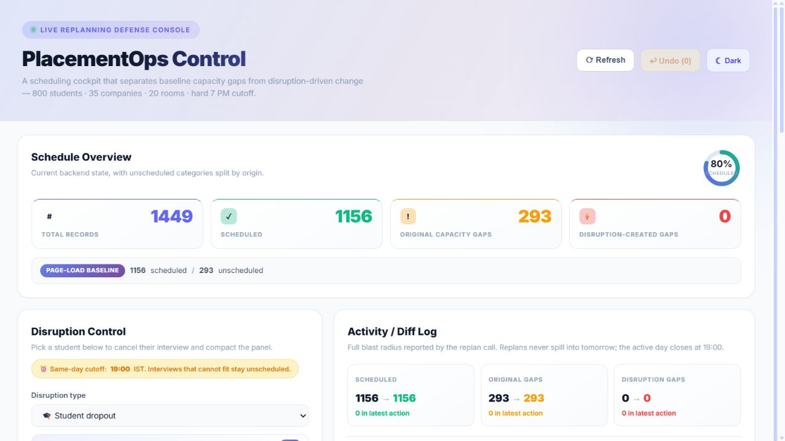
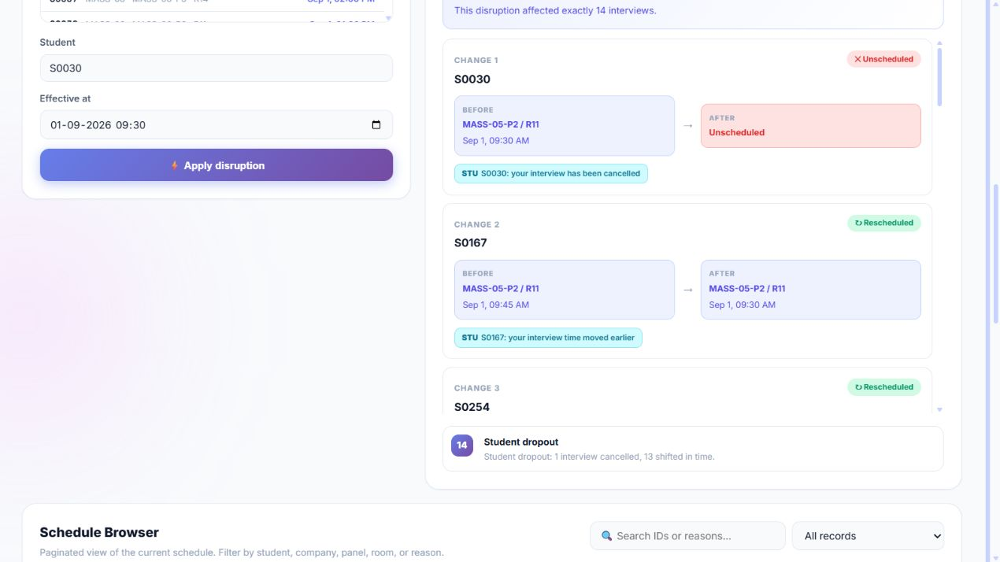
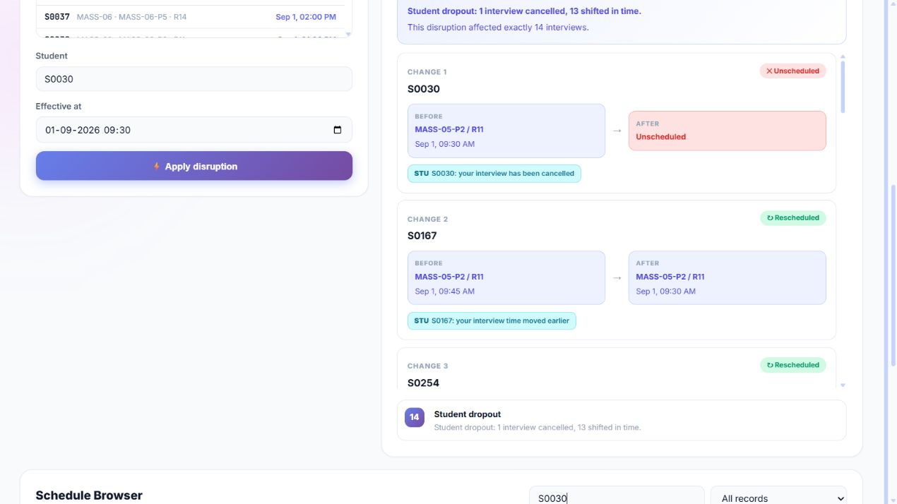
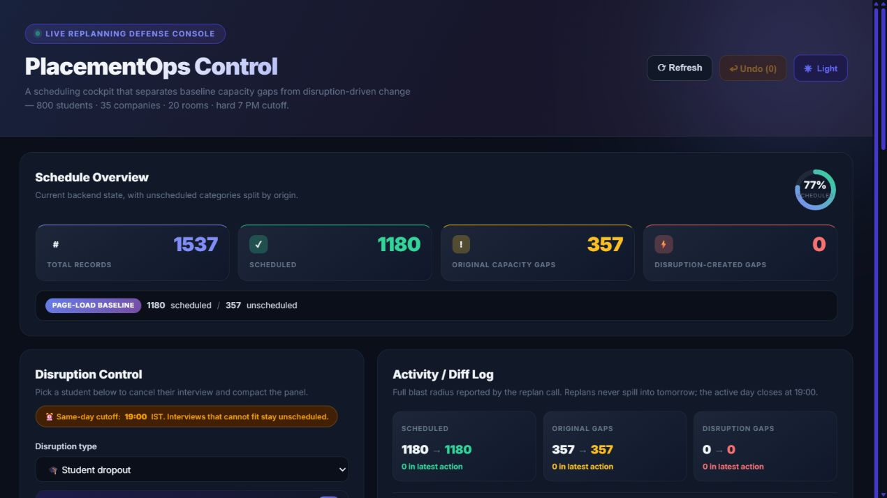

# Placement Scheduler

A full-stack placement-cell scheduling and live replanning system built for an internship skill assessment. The app generates realistic campus placement data, schedules interviews across limited rooms and panels, and lets a coordinator handle disruptions such as student dropouts, panel dropouts, late companies, and unavailable rooms.

**Live demo:** [https://placement-scheduler-two.vercel.app](https://placement-scheduler-two.vercel.app)

**Tech stack:** Go 1.22 backend, React 19 frontend, Vite, Vercel Go serverless functions.

---

## Project Demo

### Dashboard Overview

The first screen is a coordinator cockpit. It shows the generated placement schedule, scheduled percentage, baseline capacity gaps, disruption-created gaps, undo state, and the disruption form.



### Live Replanning Flow

In this example, the coordinator chooses student `S0030` and applies a student-dropout disruption. The replan engine cancels that student's interview, compacts later interviews on the same panel, and returns a before/after diff with notification messages.



### Schedule Browser

The lower section is a searchable, paginated schedule browser. It lets the coordinator inspect affected rows by student, company, panel, room, status, or unscheduled reason.



### Dark Mode

The UI also supports persisted light/dark mode, plus a `?theme=dark|light` URL override for demos and screenshots.



---

## What Problem This Solves

College placement weeks are hard to coordinate because many constraints move at the same time:

- Hundreds of students may be shortlisted by overlapping companies.
- Companies have different interview durations, panel counts, CGPA cutoffs, and day preferences.
- Rooms are limited and cannot be double-booked.
- A student cannot attend two interviews at the same time.
- A panel should stay in the same room for its working day.
- Real disruptions must be handled without rebuilding the entire plan manually.

This project models that situation as a scheduling and replanning problem. It starts from synthetic but realistic input data, produces a baseline schedule, then keeps the schedule editable through safe replan operations.

---

## Core Functionality

| Area | What it does |
| --- | --- |
| Data generation | Creates 800 students, 35 companies, company panels, 20 rooms, CGPA cutoffs, and shortlists. |
| Baseline scheduling | Runs event-driven matching wave by wave and creates scheduled or explicitly unscheduled interview records. |
| Replanning | Applies live disruptions while preserving existing constraints as much as possible. |
| Diff reporting | Shows before/after slot changes and notification targets for students, panels, or coordinators. |
| Undo | Stores recent schedule snapshots and rolls back the last disruption. |
| Dashboard | Provides metrics, disruption controls, activity logs, search, filters, pagination, and theme switching. |
| Live deployment | Serves the React app and Go API together on Vercel. |

---

## System Design

```text
placement-scheduler/
├── api/
│   └── index.go                 # Vercel serverless Go entry point
├── backend/
│   └── cmd/
│       ├── server/              # Local API server on :8080
│       ├── gen-test/            # Data generation inspection command
│       ├── scheduler-test/      # Scheduler invariant command
│       └── replan-test/         # Replan invariant command
├── pkg/
│   ├── api/                     # HTTP handlers and request validation
│   ├── bootstrap/               # Shared app initialization for local + Vercel
│   ├── generator/               # Synthetic placement data generator
│   ├── models/                  # Domain models
│   ├── replan/                  # Disruption handlers and diff model
│   └── scheduler/               # Event-driven scheduling engine
├── frontend/
│   └── src/
│       ├── App.jsx              # Main dashboard
│       ├── ThemeContext.jsx     # Theme state and persistence
│       └── App.css              # Responsive styling
├── docs/                        # README screenshots
└── vercel.json                  # Frontend build + API rewrites
```

The `pkg/bootstrap` package is shared by both `backend/cmd/server` and `api/index.go`, so local development and the deployed Vercel function initialize the same application logic.

---

## Scheduling Logic

The scheduler is built around waves. A wave is a set of companies that share the same interview window.

1. Companies are grouped by `(day, start, end)`.
2. Rooms are allocated to panels in two phases.
3. First, every company gets at least one panel if rooms allow.
4. Remaining rooms are assigned by priority, shortlist size, and deterministic ID ordering.
5. A min-heap tracks the next panel to become free.
6. The scheduler picks the next available student for that company, assigns a room, records the interview, and pushes the panel back into the heap.
7. If no slot can fit before the wave ends, the record is stored as unscheduled with a reason.

Important invariants:

- No student is double-booked.
- No room is double-booked.
- A panel keeps the same room during its schedule.
- Every failed placement has an explicit unscheduled reason.
- The generated data is deterministic from a fixed seed.

---

## Replanning Logic

Each disruption uses clone-before-mutate safety. The current schedule is cloned, the disruption is applied, and only the resulting state is committed. The previous state is saved for undo.

| Disruption | Input | Replan behavior |
| --- | --- | --- |
| Student dropout | `student_id`, `at` | Cancels the student's future interview and compacts later interviews on that panel. |
| Panel dropout | `panel_id`, `at` | Removes future interviews from that panel and tries to absorb them into surviving company panels. |
| Late company | `company_id`, `delay_minutes`, `at` | Pulls the company's future interviews back into a queue and re-runs matching from the delayed arrival time. |
| Room unavailable | `room_id`, `at` | Finds replacement room capacity per affected panel and rematches displaced interviews. |

The returned `Diff` includes the cause, changed students, before slot, after slot, notification messages, and before/after schedule summaries.

---

## API Reference

Local API base URL:

```text
http://localhost:8080
```

Live API base URL:

```text
https://placement-scheduler-two.vercel.app/api
```

| Method | Path | Description |
| --- | --- | --- |
| `GET` | `/status` | Current counts, unscheduled reasons, undo count, and operating cutoff. |
| `GET` | `/schedule` | Full interview record list. |
| `POST` | `/disruptions` | Applies one disruption and returns a diff. |
| `POST` | `/undo` | Restores the previous schedule snapshot. |

### Example: Student Dropout

```bash
curl -X POST https://placement-scheduler-two.vercel.app/api/disruptions \
  -H "Content-Type: application/json" \
  -d "{\"kind\":\"student_dropout\",\"at\":\"2026-09-01T09:00:00+05:30\",\"student_id\":\"S0030\"}"
```

### Example: Late Company

```json
{
  "kind": "late_company",
  "at": "2026-09-01T09:00:00+05:30",
  "company_id": "MASS-01",
  "delay_minutes": 120
}
```

### Example: Panel Dropout

```json
{
  "kind": "panel_dropout",
  "at": "2026-09-02T09:00:00+05:30",
  "panel_id": "MID-05-P2"
}
```

### Example: Room Unavailable

```json
{
  "kind": "room_unavailable",
  "at": "2026-09-03T09:00:00+05:30",
  "room_id": "R07"
}
```

---

## How To Run Locally

### Prerequisites

- Go 1.22+
- Node.js 18+

### Backend

From the repository root:

```bash
go run ./backend/cmd/server
```

The API starts at:

```text
http://localhost:8080
```

### Frontend

In another terminal:

```bash
cd frontend
npm install
npm run dev
```

The UI starts at:

```text
http://localhost:5173
```

For production builds, the frontend automatically calls `/api`; during local development it calls `http://localhost:8080`.

---

## Validation

Commands used to verify the project:

```bash
go test ./pkg/... ./backend/cmd/... ./api
cd frontend
npm run lint
npm run build
```

Additional manual verification:

- Opened the local dashboard in browser.
- Captured README screenshots from the running app.
- Applied a student-dropout disruption from the UI.
- Verified the diff log and schedule browser update.
- Deployed to Vercel and smoke-tested `/`, `/api/status`, `/api/disruptions`, and `/api/undo`.

---

## Deployment

The project is deployed on Vercel:

[https://placement-scheduler-two.vercel.app](https://placement-scheduler-two.vercel.app)

The Vercel setup uses:

- `frontend/dist` as the static output.
- `api/index.go` as the Go serverless function.
- `vercel.json` rewrites so `/api/*` routes reach the backend and all other paths serve the React app.

To deploy again:

```bash
vercel deploy --prod
```

---

## Assessment Highlights

- Demonstrates algorithm design with heap-based event scheduling.
- Maintains real-world constraints instead of only rendering fake data.
- Handles disruption scenarios with explicit, reviewable diffs.
- Separates static input data from mutable schedule state.
- Provides API validation, tests, and a usable frontend control dashboard.
- Includes a real hosted demo link for reviewers.

---

## License

Developed as an internship skill assessment project.
