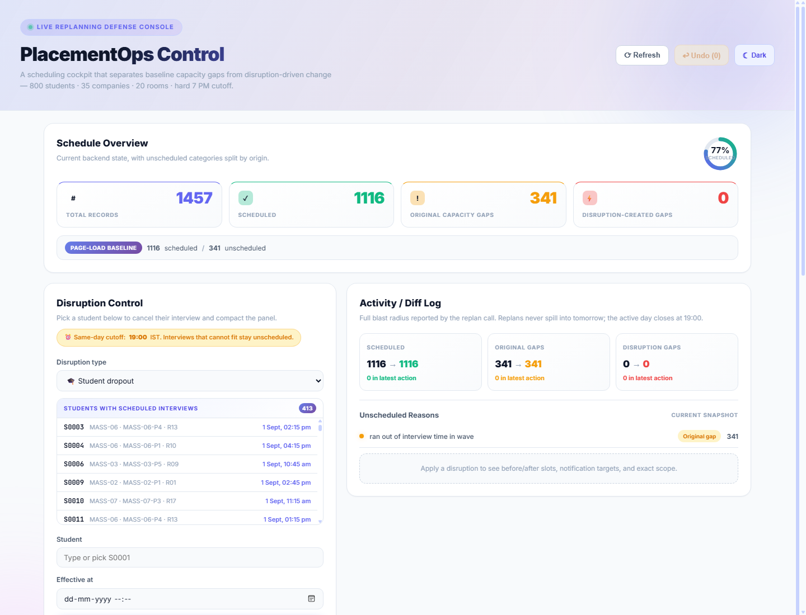

# Placement Scheduler

A real-time interview scheduling and live replanning system for college placement cells. Built with Go (backend) and React (frontend), this project solves the complex optimization problem of scheduling **800+ students across 35 companies with 20 rooms** over a 4-day placement week — and handles real-time disruptions gracefully.

> **Internship Skill Assessment** — Full-stack project demonstrating algorithm design, systems thinking, API design, and UI development.

---

## Screenshots

| Light Mode | Dark Mode |
|-----------|-----------|
|  |  |

---

## Problem Statement

College placement weeks are chaotic. Companies arrive late, panels drop out, rooms become unavailable, and students withdraw — all while hundreds of interviews need to happen in tight time windows. This system:

1. **Generates realistic placement data** — companies tiered by hiring volume (mass recruiters, mid-tier, niche), student CGPAs, shortlists, panels, and rooms
2. **Schedules interviews optimally** using an event-driven matching algorithm with panel room stickiness
3. **Handles live disruptions** by replanning affected interviews in real-time while preserving invariants
4. **Provides a control dashboard** for coordinators to trigger disruptions, view diffs, browse records, and undo changes

---

## Example Walkthrough: Late Company Disruption

To demonstrate the replanning engine, here's a concrete scenario:

### Step 1 — Initial Schedule

The system generates 1,116 scheduled interviews out of 1,457 total. The dashboard shows:

- **Total**: 1,457 students
- **Scheduled**: 1,116 interviews across 4 days
- **Unscheduled**: 341 (ran out of time in wave)

### Step 2 — Trigger a Disruption

A coordinator triggers a **Late Company** disruption via the API:

```json
{
  "kind": "late_company",
  "at": "2026-09-01T10:00:00+05:30",
  "company_id": "MASS-01",
  "delay_minutes": 120
}
```

MASS-01 (a mass recruiter with 4 panels) was supposed to start at 8:00 AM but arrives at 10:00 AM — a 2-hour delay.

### Step 3 — Replanning Engine Responds

The replan engine:

1. **Clones** the full schedule state (safe mutation)
2. **Removes** all MASS-01 interviews before 10:00 AM
3. **Re-runs** `RunMatching()` from the arrival time
4. **Compresses** idle gaps left by the delayed panels
5. **Commits** the new schedule and produces a `Diff`

### Step 4 — Review the Result

The dashboard shows the diff:

| Metric | Before | After |
|--------|--------|-------|
| Scheduled | 1,116 | 1,071 |
| Unscheduled | 341 | 386 |
| New Unscheduled Reason | — | "company delay left no remaining capacity" (45) |

**45 students** couldn't be rescheduled because the 2-hour delay consumed the remaining capacity in the morning wave. Each affected student gets a notification:

```
"your interview could not be rescheduled today due to a company delay"
```

### Step 5 — Undo

If the coordinator decides this was a mistake, they can roll back:

```bash
curl -X POST http://localhost:8080/undo
```

The schedule reverts to the exact pre-disruption state.

---

## Architecture

```
placement-scheduler/
├── backend/                          # Go 1.22 backend
│   ├── cmd/
│   │   ├── server/main.go            # HTTP API server (port 8080)
│   │   ├── scheduler-test/main.go    # Scheduler invariant validation
│   │   ├── replan-test/main.go       # Replan engine invariant validation
│   │   └── gen-test/main.go          # Data generation analysis
│   └── internal/
│       ├── models/models.go          # Core domain types
│       ├── generator/generator.go    # Synthetic data generator
│       ├── scheduler/scheduler.go    # Event-driven scheduling engine
│       ├── replan/
│       │   ├── replan.go             # 4 disruption handlers
│       │   └── dispatch.go           # Disruption type router
│       └── api/
│           ├── handlers.go           # HTTP endpoints
│           ├── disruptions.go        # Request parsing and validation
│           └── *_test.go             # API, scheduler, and replan regression tests
└── frontend/                         # React 19 + Vite frontend
    └── src/
        ├── App.jsx                   # Single-page control dashboard
        ├── ThemeContext.jsx           # Dark/light theme provider
        ├── main.jsx                  # App entry point
        └── index.css                 # Global theme tokens
```

---

## Key Features

### Data Generator (`generator.go`)

Generates realistic placement week data with configurable parameters:

| Parameter | Value | Description |
|-----------|-------|-------------|
| Companies | 35 | 8 mass recruiters, 17 mid-tier, 10 niche |
| Students | 800 | CGPA distributed ~N(7.2, 0.9) |
| Rooms | 20 | Single-panel rooms |
| Days | 4 | Sep 1–4, 2026 (IST) |

**Company tiers model real-world patterns:**

| Tier | Panels | Interview Duration | CGPA Cutoff | Shortlisted |
|------|--------|-------------------|-------------|-------------|
| Mass Recruiters | 4–6 | 15 min | 5.5–6.5 | 60–90 |
| Mid-Tier | 2–3 | 25 min | 6.5–7.5 | 30–55 |
| Niche | 1–2 | 40 min | 7.5–8.8 | 10–18 |

Student selection uses CGPA-weighted noise so top students appear on many overlapping lists — just like real placement season.

### Scheduling Engine (`scheduler.go`)

Event-driven matching using a **min-heap of panels** ordered by next-free time:

1. **Wave building**: Companies sharing the same `(day, start, end)` window are grouped into waves
2. **Panel admission**: Two-phase room allocation — guarantee one panel per company, then fill remaining rooms by priority
3. **Matching loop**: For each freed panel, find the next available student and room, book the interview, push the panel back with its new free time
4. **Room stickiness**: A panel stays in the same physical room for its entire day

**Invariants maintained:**
- No student double-booking
- No room double-booking
- Panel room stickiness (one panel = one room per day)

### Replanning Engine (`replan.go`)

Handles 4 disruption types with clone-before-mutate safety:

| Disruption | What Happens | Strategy |
|------------|-------------|----------|
| **Student Dropout** | Cancel one interview | Compact later interviews on same panel forward |
| **Panel Dropout** | Remove one panel | Absorb displaced students into surviving panels |
| **Late Company** | Company arrives late | Re-derive schedule from arrival time, compress idle gaps |
| **Room Unavailable** | Room goes offline | Find replacement room per panel, re-match displaced students |

### Frontend Dashboard (`App.jsx`)

Single-page control console with dark/light mode support:

- **Overview**: Live metrics (total, scheduled, gaps)
- **Act**: Form and QuickPick selector to trigger any of the 4 disruption types
- **Review**: Before/after diff log with notification targets and reason breakdowns
- **Inspect**: Paginated, filterable table of all 1,400+ interviews
- **Undo**: Roll back to previous state

**Theme system**: `ThemeContext` with `localStorage` persistence and `?theme=dark|light` URL parameter override for screenshots.

---

## API Reference

| Method | Path | Description |
|--------|------|-------------|
| `GET` | `/schedule` | Returns all interview records |
| `GET` | `/status` | Returns summary, undo count, operating hours |
| `POST` | `/disruptions` | Apply a disruption (triggers replan) |
| `POST` | `/undo` | Roll back last disruption |

### Disruption Types

**Student Dropout**
```json
{
  "kind": "student_dropout",
  "at": "2026-09-01T10:30:00+05:30",
  "student_id": "S0042"
}
```

**Panel Dropout**
```json
{
  "kind": "panel_dropout",
  "at": "2026-09-02T14:00:00+05:30",
  "panel_id": "MID-05-P2"
}
```

**Late Company**
```json
{
  "kind": "late_company",
  "at": "2026-09-01T10:00:00+05:30",
  "company_id": "MASS-01",
  "delay_minutes": 120
}
```

**Room Unavailable**
```json
{
  "kind": "room_unavailable",
  "at": "2026-09-03T09:00:00+05:30",
  "room_id": "R07"
}
```

All requests are validated before reaching the replan engine. Missing fields, unknown disruption kinds, and non-positive delays return `400 Bad Request`.

---

## Getting Started

### Prerequisites
- Go 1.22+
- Node.js 18+

### Backend
```bash
cd backend
go run ./cmd/server          # Starts API on :8080
go test ./...                # Run all tests
go vet ./...                 # Static analysis
go run ./cmd/scheduler-test  # Validate scheduling invariants
go run ./cmd/replan-test     # Validate replanning invariants
```

### Frontend
```bash
cd frontend
npm install
npm run dev    # Starts Vite dev server on :5173
npm run lint   # ESLint checks
npm run build  # Production build
```

---

## Tech Stack

| Layer | Technology |
|-------|-----------|
| Backend | Go 1.22, `net/http`, `container/heap` |
| Frontend | React 19, Vite 8, CSS Variables |
| Styling | Dark/light theme, glass morphism, gradient backgrounds |
| Data | Synthetic generator (seeded RNG) |
| Timezone | IST (UTC+5:30) throughout |

---

## Design Decisions

1. **Event-driven matching over greedy assignment**: The min-heap approach naturally handles panels becoming free at different times, avoiding the pitfalls of fixed-time-slot assignment.

2. **Room stickiness as a first-class invariant**: Real panels don't move rooms mid-day. The scheduler enforces this via `panelRoom` map rather than treating it as a soft preference.

3. **Clone-before-mutate for replanning**: Every replan clones the full state, attempts the change, and only commits if successful. This enables safe undo without complex rollback logic.

4. **IST internally**: All `time.Time` values use IST for correct 7 PM operating cutoff behavior. The frontend sends `+05:30` offsets.

5. **Priority tiers model real placement dynamics**: Niche companies (highest priority, fewest students) get scheduled first when there's contention, mirroring how real placement cells protect high-value recruiters.

---

## Validation

### Automated Tests

```bash
# Backend
go test ./...         # API, scheduler, replan tests
go vet ./...          # Static analysis

# Scheduler invariants
go run ./cmd/scheduler-test
# ✅ Student double-booking check PASSED
# ✅ Room double-booking check PASSED
# ✅ Panel room-stickiness check PASSED

# Replan invariants (each disruption type)
go run ./cmd/replan-test
# ✅ baseline OK
# ✅ after StudentDropout OK
# ✅ after PanelDropout OK
# ✅ after LateCompany OK
# ✅ after RoomUnavailable OK
```

### Frontend

```bash
npm run lint    # ESLint — zero errors
npm run build   # Production build — clean
```

### Manual Verification

The UI was checked in-browser at desktop and mobile widths for console errors and horizontal overflow. Screenshots captured in both light and dark themes.

---

## License

Developed as an internship skill assessment.
